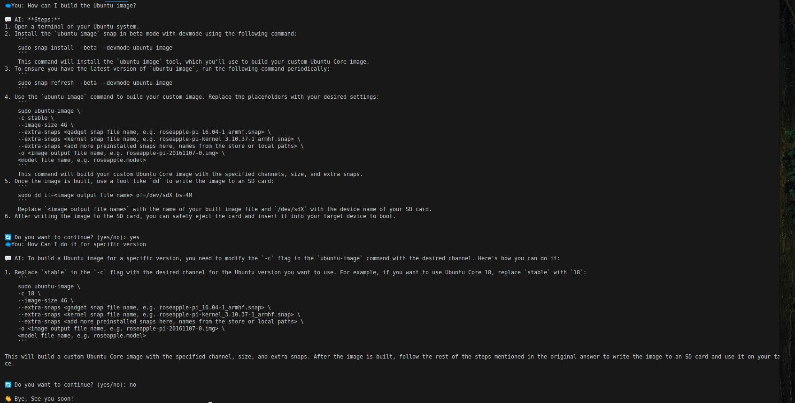
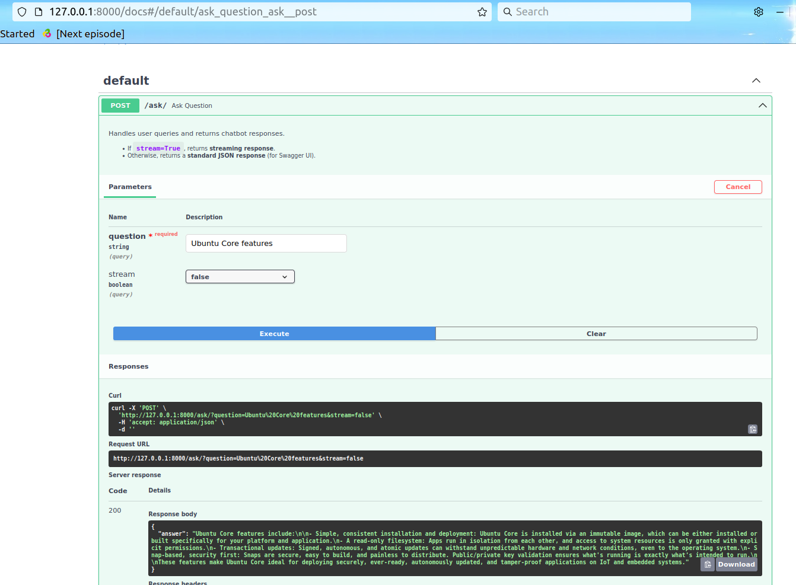
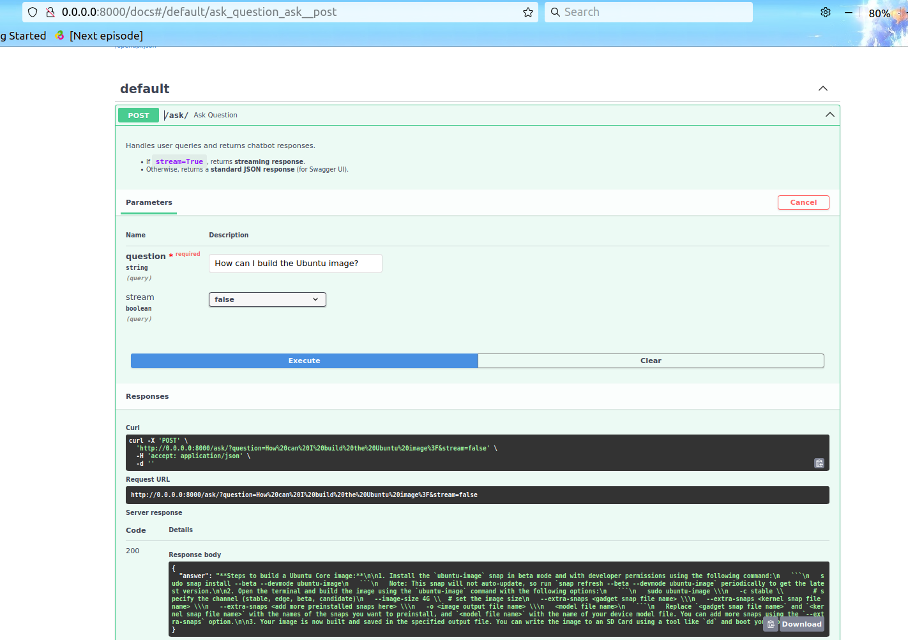

# Ubuntu Documentation QA Chatbot

 - A sample chatbot to answer user questions using  Ubuntu documentations.
 - Uses RAG pipeline:
    - Embedding model: **bge-small-en-v1.5**; Due to size limitation going with a small deployable model. 
    - **FAISS index**: For vector database creation and query search
    - LLM model: **mistral-tiny**
        - Note: OpenAi/ChatGPT couldn't use because of limit reached for all of my accounts.
- **FastAPI Endpoint Creation**: Developed a simple FastAPI application (services.py) to locally deploy the solution, allowing interaction through Swagger UI by hitting the defined endpoints.

- **Docker Deployment:** Containerized the application using Docker and tested it via Swagger, ensuring the solution works as expected in a containerized environment. 

## Retriever Strategy
- Use Markdown headings (#, ##, ###) for logical sectioning.
- Dynamic token-based chunking with overlap (512 tokens, 20% overlap).

### Further Imrprovements
- **Content-Aware Chunking:**

    Use semantic segmentation to group sentences or paragraphs that logically belong together, even if they’re not directly adjacent. This helps ensure that chunks represent meaningful content rather than just based on heading boundaries.

- **Hybrid Chunking Approach:**

    Combine token-based chunking and semantic chunking for sections that are too complex. This allows chunks to retain both structural and content-related integrity.

## Sample Screenshots

### Terminal:
- In the terminal view, the **conversational feature** is demonstrated. The model uses the **previous answer as context** for the next question, allowing the conversation to flow naturally. You can continue asking questions until you choose to exit or stop the conversation.
- The **streaming response** is also showcased here, where the response is displayed incrementally as it is generated. This gives a more dynamic interaction experience, and you can observe this feature in action in the demo video.

### Deployed Locally on Swagger UI:
- The API is built using **FastAPI**, which handles the question-answering process.
- Since **Swagger UI doesn't support response streaming** or the conversational flow, the full experience of context-aware responses will be visible once integrated with a frontend. However, the **core functionality remains intact** using the stream parameter set as False by default, and users can still interact with the API using standard request/response flow in Swagger UI.

### Deployed using Docker:
- The Docker deployment offers the **same functionality** as the locally deployed Swagger UI. The only difference is that it has been containerized using a **Dockerfile**, allowing for easy deployment and scalability in a contained environment.

### Extra Info
- Q: What are the best and fast ways to parse the documents
    - **Use a Faster Markdown Parser (e.g., mistune):**

        - Mistune is a high-performance Markdown parser in Python. It's faster and could help with parsing large documents quickly.
    - **Regex-Based Parsing:**

        - If you need high-speed extraction and the Markdown structure is consistent, you can use regular expressions to extract headings and section content.

### Updated [07/02/2024]

[Working video](screenshots/screencast.webm)